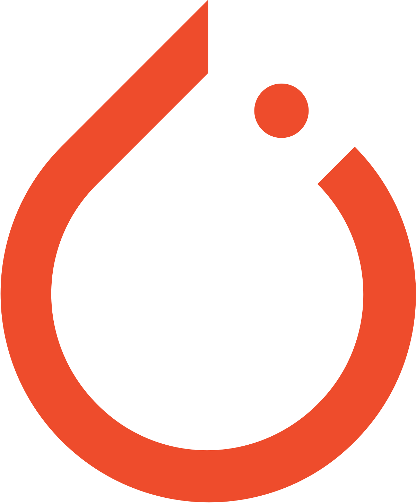

- ### Hi there, I'm Tanvir Mazharul
    
  
  

  

---

- 🔭 I am currently working at Posti Palvelut Oy.

- 🌱 I’m currently learning quantum machine learning.

- 🥅 2027 Goals: Explore more and more research of computer vision, deep learning, NLP, time series analysis, audio deep learning, satellite image segmentation, etc.

- ⚡ Fun fact: I love to code.

---
|  |  |
| ------------------------------------------------------------ | ------------------------------------------------------------ |
|  |                                                              |

   ## ⚡ Technologies I use 

<table align="center">
    <tr>
        <td align="center" width="140" height="112.43">
            
              Python
        </td>
        <td align="center" width="140" height="112.43">
            
              Jupyter
        </td>
        <td align="center" width="140" height="112.43">
            
              TensorFlow
        </td>
        <td align="center" width="140" height="112.43">
            
              Pytorch
        </td>
        <td align="center" width="140" height="112.43">
            
              Scikit Learn
        </td>
        <td align="center" width="140" height="112.43">
            
              FastAPI
        </td>
        <td align="center" width="140" height="112.43">
            
              Docker
        </td>
    </tr>
</table>

---

***Thanks for visiting my profile.***
